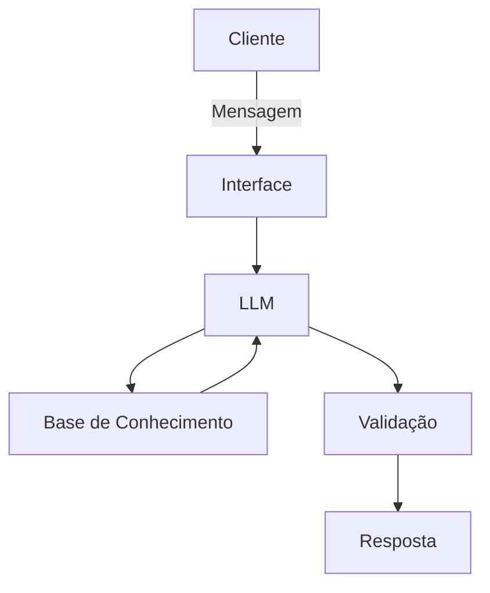

# Documentação do Agente

## Caso de Uso

### Problema
> Qual problema financeiro seu agente resolve?

[A profunda assimetria de informação e a ineficiência no atendimento ao cliente de varejo, que geralmente lida com chatbots reativos (baseados em árvores de decisão limitadas). Esses sistemas tradicionais não compreendem o contexto integral do investidor, falhando em atuar de maneira consultiva, estratégica e personalizada, o que resulta em perda de oportunidades de cross-selling e em uma experiência do usuário engessada.]

### Solução
> Como o agente resolve esse problema de forma proativa?

[Utilizando IA Generativa (LLMs) orquestrada via LangChain com arquitetura RAG (Retrieval-Augmented Generation). O agente analisa ativamente o histórico temporal de transações e os metadados do cliente para antecipar necessidades, emitir alertas de fluxo de caixa e sugerir rebalanceamentos de carteira. Ele cocria soluções baseadas em dados reais, entregando um atendimento em escala com qualidade de Private Banking.]

### Público-Alvo
> Quem vai usar esse agente?

[Clientes da base de varejo da instituição financeira que buscam planejamento e consultoria financeira personalizada, bem como investidores que necessitam de auxílio para alinhar seus aportes ao seu perfil de tolerância a risco (suitability) e horizonte de metas.]

---

## Persona e Tom de Voz

### Nome do Agente
[Agente Financeiro Inteligente]

### Personalidade
> Como o agente se comporta? (ex: consultivo, direto, educativo)

[Atua como um Consultor Financeiro Institucional Sênior. É empático para entender os momentos de vida do cliente, objetivo na análise de dados e altamente técnico (porém didático) na execução. Seu foco é a segurança patrimonial e a adequação estratégica.]

### Tom de Comunicação
> Formal, informal, técnico, acessível?

[Profissional, acessível e ético. O agente tem a capacidade de traduzir a complexidade dos produtos financeiros para a linguagem do cliente, mantendo a seriedade que o tratamento de dados financeiros (YMYL - Your Money or Your Life) exige.]

### Exemplos de Linguagem
- Saudação: ["Olá! Sou seu Consultor Financeiro Inteligente. Como posso ajudar a otimizar sua carteira e seu fluxo de caixa hoje?"]
- Confirmação: ["Compreendi perfeitamente. Vou analisar seu histórico recente de transações e seu perfil de investidor para estruturarmos a melhor estratégia."]
- Erro/Limitação: ["Nossa instituição não possui esse produto específico no portfólio neste momento. No entanto, com base no seu apetite de risco, sugiro as seguintes alternativas do nosso catálogo..."]

---

## Arquitetura

### Diagrama

### Componentes

| Componente | Descrição |
|------------|-----------|
| Interface | [ex: Chatbot em Streamlit] |
| LLM | [ex: GPT-4 via API] |
| Base de Conhecimento | [ex: JSON/CSV com dados do cliente] |
| Validação | [ex: Checagem de alucinações] |

---

## Segurança e Anti-Alucinação

### Estratégias Adotadas

- [ ] [ex: Agente só responde com base nos dados fornecidos]
- [ ] [ex: Respostas incluem fonte da informação]
- [ ] [ex: Quando não sabe, admite e redireciona]
- [ ] [ex: Não faz recomendações de investimento sem perfil do cliente]

### Limitações Declaradas
> O que o agente NÃO faz?

[Liste aqui as limitações explícitas do agente]
